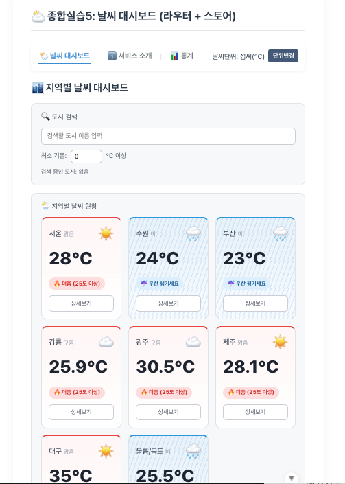
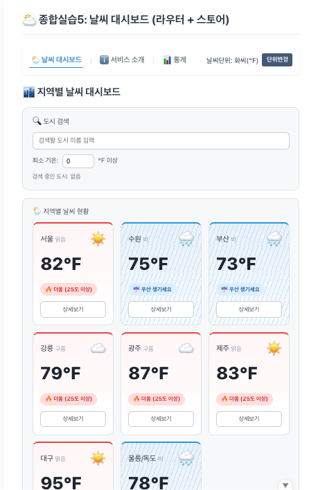
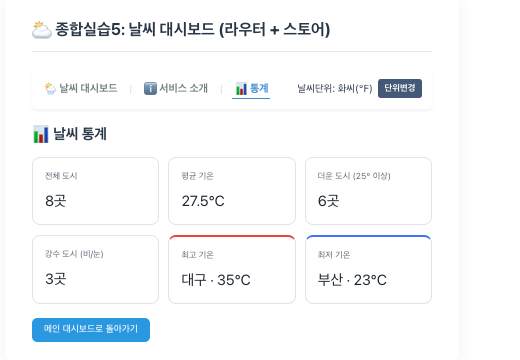
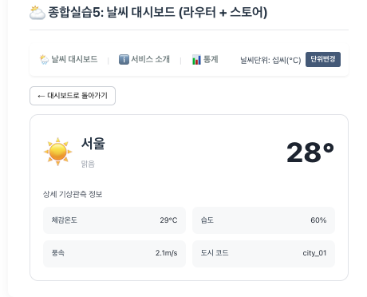

# 🌦️ 날씨 대시보드 (Weather Dashboard)

Vue 3로 만든 지역별 날씨 대시보드입니다.
컴포넌트 분리 → 라우터 적용 → 전역 상태 관리(Pinia) 순으로 앱을 점진적으로 고도화했습니다.

## 실행 방법

```bash
npm install
npm run dev
```

## 프로젝트 구조

```
src/
├── main.js                      # Pinia, Router 전역 등록
├── App.vue                      # 내비게이션 바 + RouterView
├── router/
│   └── index.js                 # 라우트 정의 (지연 로딩, Catch-all)
├── stores/
│   └── configStore.js           # 온도 단위 전역 상태 (Pinia)
├── components/
│   └── exercise/
│       ├── BaseDashboardCard.vue # slot 기반 재사용 박스
│       ├── SearchBar.vue         # 검색/필터 (props + emit)
│       ├── WeatherCard.vue       # 날씨 카드 (props + emit)
│       └── UnitToggler.vue       # 단위 전환 버튼 (store 사용)
└── views/
    ├── WeatherHomeView.vue       # 메인 대시보드
    ├── WeatherDetailView.vue     # 도시별 상세 (동적 라우팅)
    ├── WeatherAboutView.vue      # 서비스 소개
    ├── WeatherStatsView.vue      # 통계 페이지 (추가 구현)
    └── NotFoundView.vue          # 404 페이지
```

---

## 과제별 구현 내용

### 과제 3 - Component (컴포넌트 분리)

단일 파일이던 날씨 앱을 기능 변경 없이 4개 컴포넌트로 분리했습니다.

- **WeatherParent**: 모든 반응형 데이터를 보유하는 부모 컴포넌트
- **BaseDashboardCard**: `<slot>`으로 내용을 주입받는 재사용 박스 (검색/목록 영역 공통화)
- **SearchBar**: 부모에게 검색어를 `props`로 받고, 입력 시 `update-query` 이벤트를 `emit`
- **WeatherCard**: 도시 객체를 `props`로 받고, 선택(`select-card`)·상세보기(`click-detail`)를 `emit`

데이터는 부모(위) → 자식(아래)으로 `props`, 이벤트는 자식(아래) → 부모(위)로 `emit`하는 단방향 흐름을 따릅니다. 각 컴포넌트의 스타일은 `<style scoped>`로 분리했습니다.

### 과제 4 - Router (라우터 적용)

컴포넌트 앱에 Vue Router를 적용해 여러 페이지로 분리했습니다.

- `/` : 메인 대시보드 (WeatherHomeView)
- `/weather/:cityId` : 도시별 상세 페이지 (동적 경로 매칭)
- `/about` : 서비스 소개
- `/stats` : 통계 페이지
- 그 외 경로 : 404 (Catch-all Route)

주요 구현:

- **동적 라우팅**: 카드 상세보기 클릭 시 `router.push('/weather/' + id)`로 이동, 상세 페이지에서 `useRoute()`로 `cityId`를 받아 마운트 시점에 해당 도시 데이터 선택
- **지연 로딩(Lazy Loading)**: 자주 쓰는 홈은 정적 import, 나머지 페이지는 `() => import()`로 지연 로딩
- **Catch-all Route**: 정의되지 않은 경로 접근 시 404 페이지 표시

### 과제 5 - Store (Pinia 전역 상태 관리)

온도 단위(섭씨/화씨)를 Pinia로 전역 관리하여, 버튼 하나로 모든 화면의 온도가 동시에 전환됩니다.

- **configStore** (`stores/configStore.js`)
  - state: `unit` (celsius / fahrenheit)
  - getters: `unitSymbol` (°C / °F)
  - actions: `toggleUnit` (단위 토글)
- **UnitToggler**: 내비바에 배치되어 현재 단위를 표시하고 전환하는 버튼
- **단위 적용**: 각 카드가 store의 `unit`을 구독하여 `computed`로 온도를 변환 표시

---

## 추가 구현 사항

### 과제 3

- **강수(비/눈) 빗줄기 애니메이션**: CSS `repeating-linear-gradient` + `@keyframes`로 비 오는 카드 배경에 비 내리는 효과 구현
- **강수 우선 강조 로직**: 날씨 예보의 실용성을 고려해, 온도보다 강수 여부를 우선 강조 (비/눈이면 온도와 무관하게 "우산 챙기세요" 뱃지와 파란 강수 테마 적용)
- 외부 CSS와의 클래스 충돌 방지를 위해 고유 접두사(`wc-`)로 스타일 격리

### 과제 4

- **통계 페이지(WeatherStatsView) 추가**: 평균 기온, 최고/최저 기온 도시, 더운 도시 수, 강수 도시 수를 계산해 표시하는 별도 view 구현 및 라우팅
- **상세 페이지 정보 확장**: 체감온도·습도·풍속 필드를 추가해 상세 기상관측 페이지 구성
- **커스텀 404 페이지** 디자인

### 과제 5

- **단위 변환 로직**: `computed`로 섭씨를 화씨로 변환(`Math.round((c*9)/5+32)`)하여 카드 온도에 일괄 적용
- **필터 단위 일관성 확보**: 온도 표시뿐 아니라 최소 기온 필터의 라벨(°C/°F)과 비교 연산까지 현재 단위에 맞게 동작하도록 확장

---

## 실행 화면

(캡처 이미지 첨부 영역)

- 메인 대시보드
- 도시 상세 페이지
- 통계 페이지
- 단위 전환 (°C ↔ °F)

### 캡쳐본








