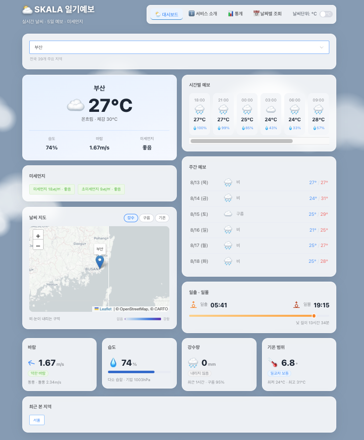
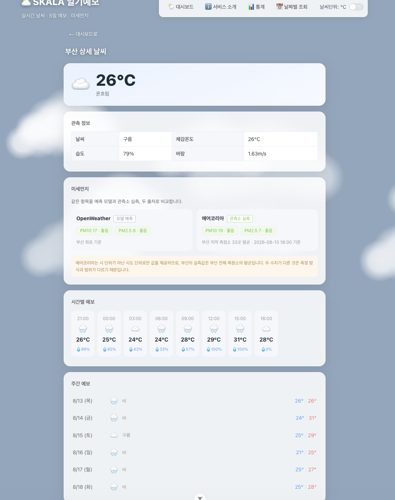
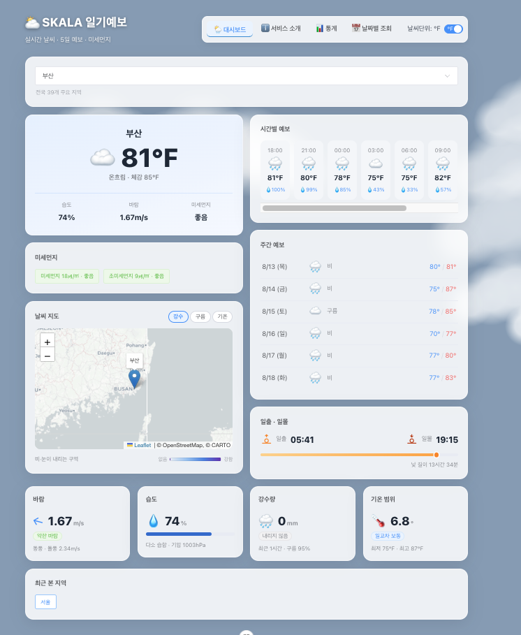
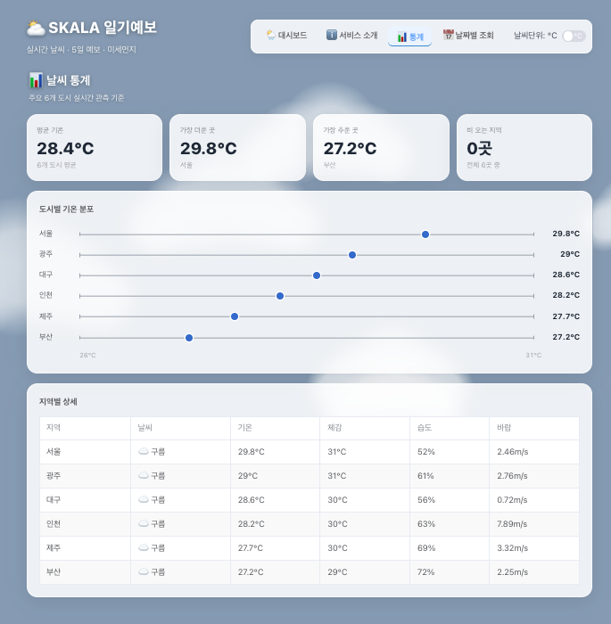
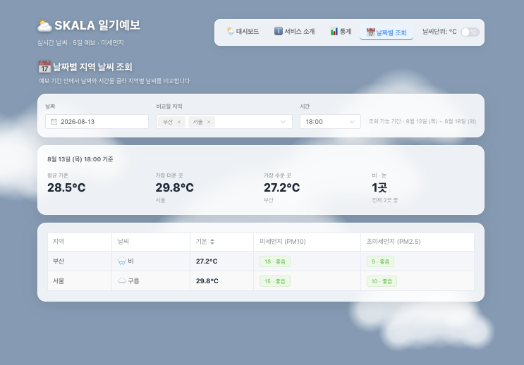
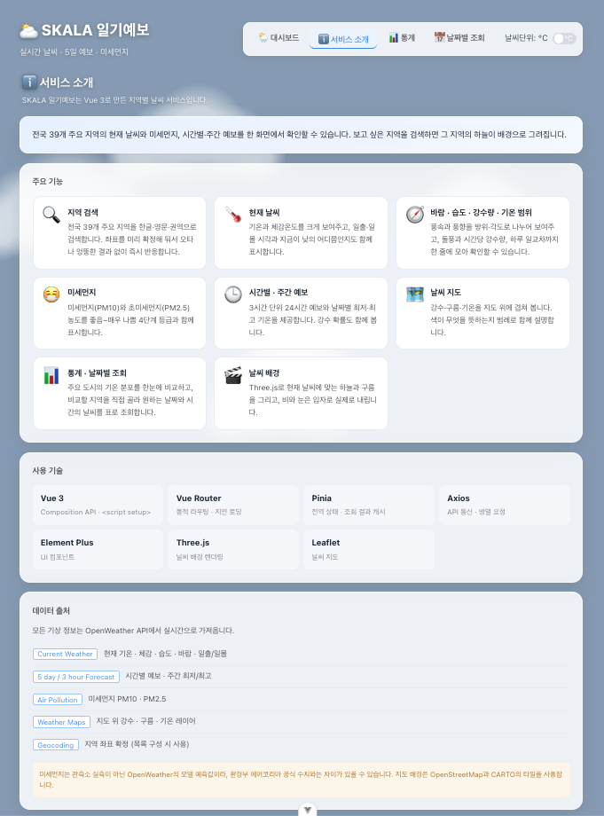

# SKALA 일기예보 (Weather Dashboard)

Vue 3 기반 실시간 날씨 대시보드입니다. 전국 39개 주요 지역의 현재 날씨·예보·미세먼지를 실제 API로 조회하고, Element Plus UI와 three.js 3D 배경, Leaflet 날씨 지도를 적용했습니다.

- GitHub: <https://github.com/jaewon-cmd/skala-vue>
- 배포 주소: <https://skala-vue-murex.vercel.app/>

## 기술 스택

- **Vue 3** (Composition API, `<script setup>`)
- **Vue Router** — 페이지 라우팅
- **Pinia** — 전역 상태 관리
- **Axios** — API 통신
- **Element Plus** — UI 컴포넌트 라이브러리
- **three.js** — 3D 날씨 배경
- **Leaflet** — 날씨 지도
- **Vite** — 빌드 도구
- **ESLint · Prettier** — 코드 품질/포맷

## 실행 방법

```bash
npm install
cp .env.example .env   # 발급받은 API 키를 채워 넣으세요
npm run dev
```

## 환경 변수

API 키는 코드에 하드코딩하지 않고 `.env`로 분리했습니다. (`.gitignore`로 저장소에서 제외)

```
VITE_OWM_KEY=OpenWeather API 키
VITE_AIR_KEY=에어코리아(공공데이터포털) 서비스키
```

> 참고: Vite는 `VITE_` 변수를 빌드 시점에 번들에 삽입하므로, 프론트엔드 앱에서 키가 완전히 감춰지지는 않습니다. `.env` 분리의 실제 목적은 **소스코드와 저장소에서 키를 떼어내는 것**이며, 키를 완전히 숨기려면 별도의 서버가 중계해야 합니다.

---

## 실행 화면

### 대시보드 — 지역 검색 · 현재 날씨 · 날씨 지도 · 예보

지역을 검색하면 현재 날씨와 함께 시간별·주간 예보, 일출·일몰, 바람·습도·강수량·기온 범위 카드가 한 화면에 표시됩니다. 배경의 하늘과 구름은 그 지역의 실제 날씨에 맞춰 three.js로 그려집니다.



### 지역 상세 — 미세먼지를 두 출처로 비교

대시보드의 `○○ 상세 보기` 버튼으로 들어갑니다. 같은 항목을 **OpenWeather(모델 예측)** 와 **에어코리아(관측소 실측)** 두 API로 받아 나란히 보여 줍니다. 아래 부산 화면에서는 예측 PM10 17, 실측 PM10 19로 값이 다른데, 측정 방식과 범위가 다르기 때문이며 그 이유를 화면에도 함께 안내합니다.



### 섭씨 · 화씨 전환

상단 토글 한 번으로 모든 화면의 온도 표기가 바뀝니다. Pinia로 단위 상태를 전역 관리하기 때문에 현재 기온·체감온도·시간별 예보·주간 예보가 한꺼번에 전환됩니다. (아래는 위 대시보드와 같은 지역·같은 시점)



### 통계 — 요약 지표와 기온 분포 그래프

도시별 기온이 좁은 구간에 몰려 있어 막대그래프 대신 위치로 값을 나타내는 점 그래프를 썼습니다. 축 양 끝에 실제 범위를 표시하고, 그래프에 없는 값은 아래 표에서 모두 읽을 수 있습니다.



### 날짜별 조회 — 비교할 지역을 골라 시점별 비교



### 서비스 소개



---

## 과제 요구사항 대응 (채점 기준)

### 1. OpenWeatherMap API로 실제 날씨 데이터 적용

기존 목업(가짜) 데이터를 전부 걷어내고, OpenWeather의 **Current Weather API**로 실제 날씨를 받아 화면에 표시합니다. 지역을 선택하면 현재 기온·날씨 상태·체감온도·습도·바람·풍향·강수량·일출/일몰을 실시간으로 조회합니다.

- 한 지역을 조회할 때 현재 날씨·대기오염·예보 **3개 API를 `Promise.all`로 병렬 호출**해, 가장 느린 응답 하나만큼만 기다립니다.
- 영문 날씨 상태(`Clear`, `Rain` …)를 한글로 변환하는 매핑 테이블을 두었습니다.
- 좌표로 조회하면 응답의 지역명이 `Namhyang-dong`처럼 동 단위로 나오기 때문에, 표시명은 자체 지역 목록의 한글명을 사용합니다.

### 2. OpenWeatherMap 추가 API로 기능 확장

같은 OpenWeather에서 **다른 API를 네 개 더** 붙여 기능을 확장했습니다.

| API                                           | 사용처                                                        |
| --------------------------------------------- | ------------------------------------------------------------- |
| **5일/3시간 예보** (`/forecast`)              | 시간별 예보(24시간), 주간 예보(날짜별 최저·최고), 일교차 계산 |
| **대기오염** (`/air_pollution`)               | 현재 미세먼지(PM10)·초미세먼지(PM2.5) 농도와 등급             |
| **대기오염 예보** (`/air_pollution/forecast`) | 날짜별 조회 화면의 시간대별 미세먼지                          |
| **Weather Maps** (타일)                       | 지도 위 강수·구름·기온 레이어                                 |

3시간 간격 예보를 날짜별로 묶어 최저·최고 기온을 구하고, 그날을 대표하는 날씨는 정오 값을 사용했습니다.

추가로 **Geocoding API**(`/geo/1.0/direct`)로 39개 지역의 좌표를 미리 조회해 확정했습니다. 한글 검색어를 그대로 API에 넘기면 `강릉`은 결과가 없고 `강원`은 중국 지명이 나오는 문제가 있어, 좌표를 상수로 고정하는 방식을 택했습니다. (실행 중에는 호출하지 않습니다)

### 3. 기타 외부 API로 기능 확장

OpenWeather가 아닌 **에어코리아(공공데이터포털) 대기오염정보 API**를 연동해, 지역 상세 화면에서 **같은 미세먼지를 두 출처로 비교**할 수 있게 했습니다.

|           | OpenWeather    | 에어코리아             |
| --------- | -------------- | ---------------------- |
| 성격      | 모델 예측값    | 관측소 실측값          |
| 범위      | 지역 좌표 기준 | 시도 전체 측정소 평균  |
| 함께 표시 | —              | 측정소 개수, 측정 시각 |

같은 시각에도 두 값은 다르게 나옵니다. (예: 수원 — 예측 PM10 16 / 실측 PM10 10, 경기 지역 측정소 94곳 평균) 이는 오류가 아니라 측정 방식과 범위가 다르기 때문이며, 화면에도 그 이유를 함께 안내합니다.

**구현 시 다룬 문제들**

- **CORS** — 브라우저에서 직접 호출하면 막히므로 프록시를 구성했습니다. 개발 환경은 Vite `server.proxy`, 배포 환경은 호스팅 리다이렉트(`vercel.json`, `public/_redirects`)로 `/airkorea` → `https://apis.data.go.kr` 경로를 중계합니다.
- **실패해도 HTTP 200을 주는 API** — 에어코리아는 오류일 때도 상태 코드 200에 본문만 `OpenAPI_ServiceResponse.cmmMsgHeader.errMsg` 형태로 바꿔 돌려줍니다. 실제로 `SERVICETIMEOUT_ERROR`가 간헐적으로 발생했습니다. 그래서 상태 코드가 아니라 **응답 본문의 형태**로 성공 여부를 판단하고, 실패해도 OpenWeather 값은 정상 표시되도록 분리했습니다.
- **시도 단위 제약** — 에어코리아는 시가 아닌 **시도 단위(17개)로만** 조회할 수 있어, 39개 지역 각각에 해당 시도명을 매핑했습니다(청주→충북, 천안→충남 등). 같은 시도에 속한 지역은 결과를 공유해 중복 호출하지 않습니다.
- **결측 처리** — 측정소별로 값이 `-`이거나 통신장애로 비어 있는 경우가 있어, 숫자로 읽히는 값만 걸러 평균을 냅니다.

### 4. 외부 UI 라이브러리 적용 (Element Plus)

수업에서 다룬 **Element Plus**를 선정해 앱 전반에 적용했습니다.

| 구분  | 사용한 컴포넌트                | 적용 위치                                   |
| ----- | ------------------------------ | ------------------------------------------- |
| Basic | `el-button`                    | 상세보기·돌아가기 버튼                      |
| Form  | `el-switch`                    | 섭씨/화씨 단위 토글                         |
| Form  | `el-select`, `el-option-group` | 지역 검색 드롭다운 (권역별 그룹)            |
| Form  | `el-select` (multiple)         | 날짜별 조회의 비교 지역 다중 선택           |
| Form  | `el-date-picker`               | 날짜별 조회 날짜 선택 (예보 범위 밖 비활성) |
| Data  | `el-card`                      | 날씨 카드                                   |
| Data  | `el-tag`                       | 날씨 상태·미세먼지 등급·바람 세기 배지      |
| Data  | `el-table`                     | 날짜별 지역 조회 표                         |
| Data  | `el-descriptions`              | 상세 화면 관측 정보 표                      |

### 5. 코드 품질 관리 & 배포 (Vite Build & Deployment)

- **Lint** — `npm run lint`(oxlint + ESLint)로 점검해 **에러 0건, 경고 0건**을 유지했습니다.
- **환경 변수 분리** — API 키를 `.env`로 옮기고 `.gitignore`에 등록했습니다. 키가 `weatherStore.js`·`WeatherMap.vue`·`AxiosWeather.vue` **3개 파일**에 흩어져 있어 전부 `import.meta.env`로 치환했습니다.
- **빌드** — `npm run build`로 정적 파일(`dist/`)을 생성합니다.
- **배포 설정** — Vercel(`vercel.json`)과 Netlify(`netlify.toml`, `public/_redirects`) 양쪽 설정을 준비해 두었습니다.
- **SPA 폴백** — `createWebHistory` 라우팅이라 `/stats` 직접 접속이나 새로고침 시 404가 납니다. 모든 경로를 `index.html`로 넘기는 설정을 추가해 해결했습니다.

---

## 사용한 Vue 핵심 기능 (학습 내용)

수업에서 배운 Vue 기능을 실제로 어떻게 썼는지 정리했습니다.

- **반응성** — `ref`, `computed`(단위 변환·검색 필터·통계·일교차), `watch`(날짜 변경 시 시간 목록 갱신, 날씨 변화 시 3D 배경 교체)
- **디렉티브** — `v-if`/`v-else-if`/`v-else`(로딩·에러·정상 분기), `v-for`(카드·예보·표), `v-bind`(동적 클래스, 풍향 회전 각도 등 인라인 스타일), `v-on`(이벤트), `v-model`(입력·토글·다중 선택)
- **컴포넌트 통신** — `props`(WeatherMap에 지역 좌표 전달, WeatherBackground에 날씨 상태 전달), `emit`(WeatherCard의 카드 선택·상세보기), `slot`(AppContainer가 페이지를 끼워 넣는 공통 레이아웃)
- **생명주기 훅** — `onMounted`(API 호출, three.js·Leaflet 초기화), `onUnmounted`(렌더러·지도 자원 정리)
- **Vue Router** — 동적 라우팅(`/weather/:cityId`), 지연 로딩(lazy import), catch-all NotFound, `useRoute`/`useRouter`
- **Pinia** — `defineStore`, state/getters/actions, `storeToRefs`로 반응성 유지 (weatherStore: 날씨 데이터·조회 캐시, configStore: 단위 설정)
- **Axios** — `async/await`, `Promise.all`, `try/catch/finally`, `params` 옵션, 개별 `catch`로 부분 실패 허용

---

## 본인만의 추가 아이디어 (보너스)

교안 기본 요구사항을 넘어서, 배운 Vue 기능을 활용해 다음을 직접 추가했습니다.

1. **three.js 실시간 3D 날씨 배경** — 검색한 지역의 현재 날씨에 따라 하늘색이 바뀌고, 날씨별로 구름의 개수·색·속도가 달라집니다. 비/눈일 때는 입자가 떨어지고, 바람일 때는 구름이 빠르게 흘러갑니다. 구름 텍스처는 이미지 파일 없이 캔버스에 원을 겹쳐 그려 만들었고, 모든 구름이 하나의 텍스처를 공유합니다. `onMounted`/`onUnmounted`로 렌더러를 생성·정리하고, `watch`로 날씨 변화를 감지해 갱신하면서 이전 자원을 `dispose()` 합니다.

2. **Leaflet 날씨 지도** — 강수·구름·기온 레이어를 지도 위에 겹쳐 봅니다. 일반 지도는 색이 강해 날씨 오버레이가 묻히기 때문에 밝은 회색 베이스맵을 쓰고, 색의 의미를 알 수 있도록 레이어별 범례를 함께 표시합니다. 지역을 바꾸면 지도도 따라 이동합니다.

3. **전국 39개 지역 검색** — 지역을 권역별로 그룹화하고 한글명·영문명·권역명으로 검색할 수 있게 했습니다. 좌표를 미리 확정해 두어 API 왕복 없이 즉시 반응합니다.

4. **최근 본 지역** — 조회 결과를 캐시에 저장해, 다시 API를 부르지 않고 칩 클릭만으로 재조회합니다.

5. **날짜별 지역 조회** — 비교할 지역을 직접 고르고 날짜·시간을 선택하면, 해당 시점의 지역별 날씨·미세먼지를 표로 비교할 수 있습니다. **이미 받아둔 지역은 다시 호출하지 않아** 지역을 추가해도 필요한 만큼만 요청합니다.

6. **섭씨/화씨 전환** — Pinia로 단위 상태를 전역 관리해, 토글 한 번으로 모든 화면의 온도 표시가 일관되게 바뀝니다.

7. **지표 카드 4종** — 바람(풍향 화살표·돌풍), 습도(막대·등급), 강수량(시간당 mm), 기온 범위(일교차)를 한 줄에 배치했습니다. 지표를 고를 때 **여러 지역의 실제 값을 비교해** 지역별로 차이가 나는 값만 남겼습니다. 기압(전국 편차 3hPa)과 가시거리(전국 모두 10km)는 지역 구분이 안 되어 카드에서 제외했습니다.

8. **통계 화면의 기온 분포 그래프** — 도시별 기온이 좁은 구간에 몰려 있어, 0부터 그리는 막대그래프로는 차이가 보이지 않고 축을 자르면 왜곡이 생깁니다. 그래서 **길이 대신 위치로 값을 나타내는 점 그래프**로 표현하고 축 양 끝에 실제 범위를 표시했습니다.

9. **미세먼지 두 출처 교차 비교** — 같은 항목을 OpenWeather(모델 예측)와 에어코리아(관측소 실측) 두 API로 받아 상세 화면에 나란히 놓았습니다. 한쪽만 쓰면 그 값이 맞는지 알 수 없지만, 나란히 두면 예측과 실측의 차이가 드러납니다. 한쪽이 실패해도 다른 쪽은 그대로 보이도록 조회를 분리했습니다.

10. **공통 레이아웃 컴포넌트화** — 헤더·메뉴·배경 틀을 `AppContainer`로 분리하고 `<slot>`으로 페이지를 끼워 넣었습니다. 본문은 반투명 유리 카드로 나누어 3D 배경이 카드 사이로 비쳐 보이게 하되, 어두운 배경(비 오는 날)에서도 글씨가 읽히도록 대비를 계산해 농도를 정했습니다.

---

## 프로젝트 구조

```
├── .env.example              # 환경 변수 예시 (실제 .env는 git 제외)
├── vercel.json               # Vercel: SPA 폴백 + 에어코리아 프록시
├── netlify.toml              # Netlify: 빌드 설정
├── public/_redirects         # Netlify: SPA 폴백 + 에어코리아 프록시
└── src/
    ├── components/
    │   ├── exercise/         # WeatherCard, UnitToggler, SearchBar 등
    │   ├── layout/           # AppContainer, WeatherBackground(three.js), WeatherMap(Leaflet)
    │   └── practices/        # 수업 중 실습 컴포넌트
    ├── constants/
    │   └── regions.js        # 전국 39개 지역 목록 (좌표 확정)
    ├── stores/
    │   ├── weatherStore.js   # 날씨 데이터 · 조회 캐시 (Pinia)
    │   └── configStore.js    # 온도 단위 설정 (Pinia)
    ├── router/
    │   └── index.js          # 라우터 (동적 라우팅 · 지연 로딩 · catch-all)
    └── views/
        ├── WeatherHomeView.vue    # 대시보드 (지역 검색)
        ├── WeatherDetailView.vue  # 지역 상세
        ├── WeatherStatsView.vue   # 통계
        ├── WeatherRangeView.vue   # 날짜별 조회
        ├── WeatherAboutView.vue   # 서비스 소개
        └── NotFoundView.vue       # 404
```
